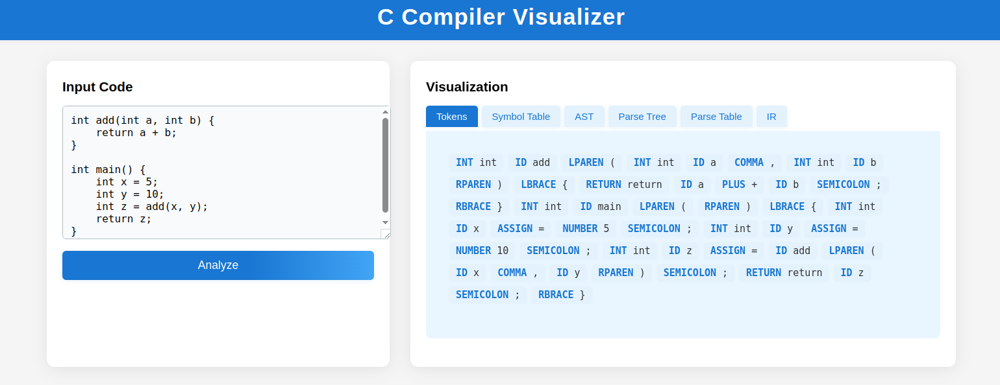
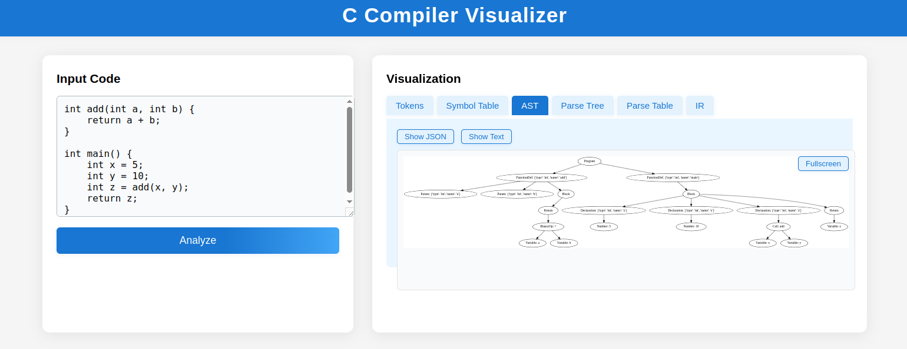
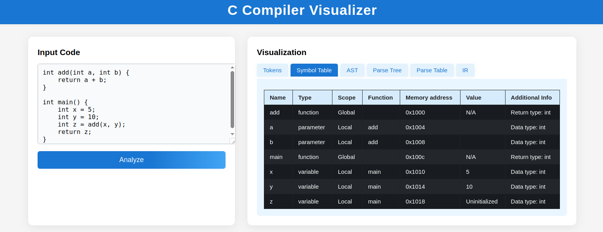

# C Compiler Visualizer

A modern, interactive web-based visualizer for the first phases of C compilation: Lexical Analysis, Syntax Analysis, Semantic Analysis, and Intermediate Representation (IR) generation. This project is designed for learning, teaching, and exploring how a C compiler works under the hood.

---

## Features

- **Modern Tabbed UI**: Visualize each compilation phase in its own tab (Tokens, Symbol Table, AST, Parse Tree, Parse Table, IR).
- **Responsive Design**: Clean, mobile-friendly interface with beautiful, accessible styling.
- **Space-separated Token Display**: Tokens are shown as colored, space-separated chips that wrap as needed.
- **AST Visualization with Toggle**: View the Abstract Syntax Tree as an SVG diagram or as a JSON/dict (toggle with a button).
- **Parse Table Toggle**: Switch between a rich table view and JSON for the parse table.
- **IR Generation**: See the generated intermediate representation for your C code, including support for:
  - Function definitions and calls (with parameters)
  - Variable declarations and assignments
  - Binary operations and return statements
- **Symbol Table**: View a detailed symbol table with scope, type, address, and more.
- **Parse Tree Visualization**: See the full parse tree as an SVG.
- **Robust Backend-Frontend Integration**: All features are tightly integrated for a seamless experience.

---

## Setup

1. **Install Python 3.7 or higher**
2. **Install dependencies:**
   ```bash
   pip install -r requirements.txt
   ```
3. **Run the Flask server:**
   ```bash
   python app.py
   ```
4. **Open your browser:**
   Navigate to [http://localhost:5000](http://localhost:5000)

---

## Usage

1. **Enter C code** in the input panel (left side).
2. **Click "Analyze"** to process your code.
3. **Switch between tabs** to explore:
   - **Tokens**: Lexical tokens as space-separated chips.
   - **Symbol Table**: All variables, functions, and their properties.
   - **AST**: Abstract Syntax Tree (SVG or JSON view).
   - **Parse Tree**: Full parse tree (SVG).
   - **Parse Table**: LALR parse table (table or JSON view).
   - **IR**: Intermediate Representation (step-by-step code).
4. **Toggle Views**:
   - In the AST tab, use the "Show JSON"/"Show SVG" button to switch between diagram and JSON.
   - In the Parse Table tab, use the "Show JSON"/"Show Table" button to switch views.

---

## UI Implementation

The user interface for the C Compiler Visualizer is designed with modern web technologies:

- **Framework**: Built with HTML5, CSS3, and vanilla JavaScript for maximum performance and compatibility.
- **Layout System**: Uses CSS Grid and Flexbox for responsive layouts that adapt to different screen sizes.
- **Tabbed Interface**: Custom implementation with event listeners that show/hide content panels when tabs are clicked.
- **Visualization Integration**:
  - **SVG Generation**: Dynamic SVG generation for AST and Parse Tree using JavaScript DOM manipulation.
  - **Token Highlighting**: Custom CSS classes for different token types with color coding.
  - **Table Generation**: Dynamic HTML table creation for Symbol Table and Parse Table views.
- **Toggle Functionality**: JavaScript event handlers manage state transitions between different visualization modes.
- **Responsive Design**: Media queries ensure the UI remains functional on devices of all sizes.
- **AJAX Requests**: Asynchronous communication with the Flask backend for code analysis without page reloads.
- **Error Handling**: Elegant error display with descriptive messages when compilation issues occur.

The UI prioritizes clarity and educational value, with each visualization designed to highlight specific aspects of the compilation process.

---

## Example Code

```c
int add(int a, int b) {
    return a + b;
}

int main() {
    int x = 5;
    int y = 10;
    int z = add(x, y);
    return z;
}
```

---

## Screenshots

> _


---

## Project Structure

- `app.py` — Main Flask application, API endpoints, and integration logic.
- `compiler/lexer.py` — Lexical analyzer (tokenizer).
- `compiler/lalr_parser.py` — LALR parser, AST and parse tree generation.
- `compiler/semantic_analyzer.py` — Semantic analysis and symbol table construction.
- `compiler/ir_generator.py` — IR generation for C code (supports functions, calls, variables, binary ops, returns).
- `compiler/parsetab.py` — LALR parse table (auto-generated).
- `templates/index.html` — Main web UI (modern tabbed interface, all visualization logic).
- `static/` — (Optional) For additional CSS/JS if needed.

---

## Notable Improvements & Customizations

- **UI/UX**: Modern, tabbed, and responsive interface for easy navigation.
- **Token Display**: Space-separated, flex-wrapped tokens for readability.
- **AST Toggle**: Instantly switch between SVG and JSON views of the AST.
- **Parse Table Toggle**: Switch between a rich table and JSON for deep inspection.
- **IR Support**: Handles function definitions, calls, parameters, variable declarations, assignments, binary operations, and returns.
- **Robust Error Handling**: User-friendly error messages for invalid code.
- **Extensible**: Easy to add new language features or visualizations.

---

## Contributing

Pull requests and suggestions are welcome! Please open an issue or PR if you have ideas for improvements or new features.

---

## License

@Dheeraj Chandra